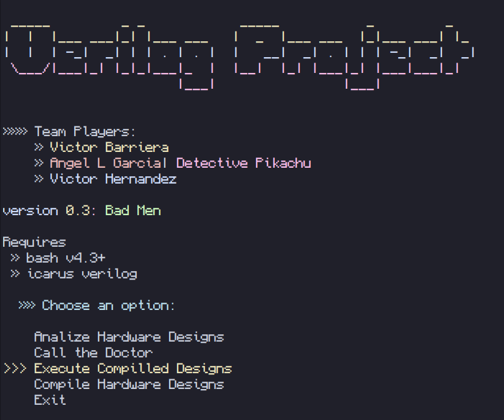

# SPARC V8 Based Hardware Design

## Overview

This project is a verilog hardware design of the SPARC V8 architecture. The design includes the implementation of four pipelines: IF/ID, ID/EX, EX/MEM, and MEM/WB.

## Designers

The design was created as part of a college course in Computer Architecture (ICOM4215) taught by Dr. Nestor J. Rodriguez by a team of three students:

- Detective Pikachu (Angel L Garca)
- Dinkleberg (Victor Hernandez)
- The Rat Man (Victor Barriera)

## Motivation

The goal of this project is to design and implement a super simple hardware version of the SPARC V8 architecture. By working on this design, we hope to gain a better undesanding of how computers really work at a hardware level, improve our technical skills in hardware design and learn the Verilog hardware language.

## Challenges

There were both internal and external challenges in this project. The first challenge was the fact
that we knew nothing of verilog when we started. The second was that we were a bit rough on the edges when it came to working with logic circuits. And the third was that it took some time for us to 'click' on how SPARC V8 works. Funny thing I remember is when we confused V8 with V9 and were for a month or two using SPARC V9 as reference and didn't realized until we meet with the professor. That said we continuously read the presentations, watch his videos on YT and asked him
our doubts where we did some dumb stuff from time to time, but hey everyone does it when learning.

Anyway, during phase 1 we pretty much spearheaded it. Doing the basic components in sparc wasn't so hard, tho we had to meet with the professor a few times to fix some minor bugs here and there.

Phase 2 was the filter phase. A freaking diagram... turned out to be the filter phase... let that sink in. Lots of classmates dropping because of how challenging this phase was. You basically needed to have a very good grasp on an abstract system and in this case, on SPARC. The funny thing however was that many of the issues we had could be solved with logic boxes. If it was too hard to grasp or put into multiplexers, just put a logic box and call it a day. It took us almost 1 and half months to actually grasp that... yeah, that's the sound of feeling ashamed. The other thing that was quite the challenge was dealing with branches and figuring out a way to modify the PC based on the instruction we had during the *Decoding Stage*. Like, bruh, we tried having lots of multiplexers, we tried to put a single big logic box, we tried different combinations and each time our professor asked us to see if know what we oversaw a small, discrete detail that essentially changed everything. 

The last crazy blooper was when we connected the CU signals directly to the respective pipeline and completely forgot to propagate the signal across each pipeline. Translating this in verilog would cause it to have an unsynchronized system because the system is having a seizure. That and the fact that we connected the output of the ALU into both the address and the Data In of the Data Memory, which means that instead of saving the destination operand we saved the address... in the address... instead of connecting the destination operand that was propagated into the Data In to save it... You can imagine how the conversation went when the professor facepalmed for us doing that.

So after bleeding blood and tears and performing multiple ritual sacrifices we managed to pass phase 2 and unto phase 3. This phase was back to verilog, but we'd be designing part of the system, being the pipelines along with the CU and its multiplexer that will not do anything. "It's going to be easy", we said. "It's just like phase 1 but a bit bigger", we said. We couldn't be any more wrong. Making different components tto work with each other was easy, making it work properly at the correct clock-time was harder than we expected. We had issues monitoring out our signals because of the large number of signals we had to keep track of. Eventually we had to search for a tool and found GTK-Wave. Its a free open-source tool available on Windows, GNU/Linux and OS-X that takes a .vcd file and allows the user to keep track of a hardware design's input and outputs (including their inner components) much easier.

For this phase we made small mistakes that if it wasn't for GTK-Wave, we could've have seen it (or maybe we could but would've taken longer).

## Running the Project

It is important to first download Icarus Verilog for windows machines to either get Git Bash or WSL in order to execute bash scripts.

After installing the necessary programs, clone this project and navigate to project/scripts and execute the `wizard.sh` script. This will build all the design components in a build folder located in the project folder. navigate to the build folder and in a terminal pointed at this directory type:


```bash
./<build-file>
```

You'll get something like this:



## Design

The SPARC V8 verilog hardware design includes the following components:

- [ALU](/documentation/alu.md)
- [Operand2 Handler](/documentation/operand-handler.md)
- [Instruction Memory](/documentation/instruction-memory.md)
- [Register File](/documentation/register-file.md)
- [PSR (Processor State Register)](/documentation/psr.md)

***[Handlers](/documentation/handlers.md)***

- Data Memory
- Control Unit
- Reset Handler
- Condition Handler
- PC/nPC Handler
- WB Output Handler

## PPU Diagram


## Optional Stuff for Fun

Although it was not specified in the requirements, since all classmates are studying computer engineering and one of the team mates took a VHDL bootcamp, we decided to also include a few analysis using python.

These include:

- Timing Analysis
- Power Analysis
- Fault Analysis

## Future Work

While this simple (yet challenging) design met our goals, there are several areas where we could improve and expand in the future. Here are some possible improvements:

1. **Floating Point Support**: Currently, our design does not include support for floating point operations. In the future, we could explore adding floating point units and instructions to our design to enable floating point calculations.

2. **Cache Hierarchy**: Our current design includes a single data memory unit. In a real-world implementation, however, there would typically be multiple levels of cache memory between the processor and main memory. In the future, we could explore adding a cache hierarchy to our design to improve performance.

3. **Instruction Set Extensions**: While we implemented the basic SPARC V8 instruction set, there are several instruction set extensions available that could improve performance or enable new functionality. In the future, we could explore adding these extensions to our design.

## PS from one of the students

There's not that many SPARC-based designs out there on Github and from what I searched, I only found 1 github repo of a SPARCV8 based architecture design at so happens to come from the same University me and the team study. That repo is 9 years old. Very ancient repo that made my chuckle a few times after reading Pol's commits.
